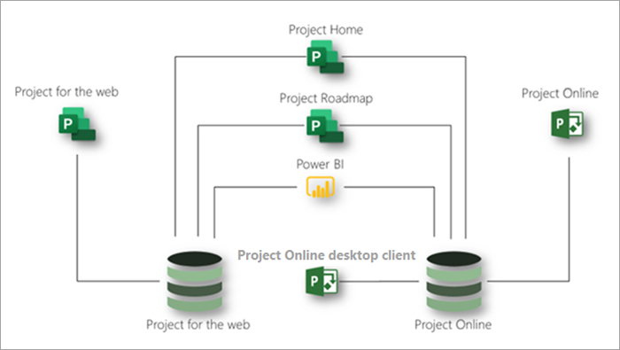

# Microsoft 项目服务说明Microsoft Project service description

## 概述Overview

Microsoft Project提供以下应用程序，以帮助满足组织对项目和工作管理的需求：Microsoft Project offers the following applications to help meet your organization's needs for project and work management:

- Project 网页版Project for the web
- Project OnlineProject Online 
- Project Online桌面客户端Project Online desktop client

本文将帮助你了解每个订阅中提供的应用程序Project以及每个应用程序提供的功能。This article will help you understand which applications are provided in each Project subscription and what capabilities each application offers.

### Project 网页版Project for the web

Project是 Microsoft 最新的基于云的工作和项目管理产品/服务。Project for the web is Microsoft's most recent offering for cloud-based work and project management. Project Web 服务提供了简单、强大的工作管理功能，以满足大多数需要和角色。Project for the web provides simple, powerful work management capabilities to meet most needs and roles. Project管理员和团队成员可以使用 Project Web 功能来规划和管理任何规模的工作。Project managers and team members can use Project for the web to plan and manage work of any size.

Project构建于 Microsoft Power Platform 上。Project for the web is built on the Microsoft Power Platform. Power Platform 由 PowerApps、Power Automate、Power BI 和 Microsoft Dataverse 组成。The Power Platform consists of PowerApps, Power Automate, Power BI, and the Microsoft Dataverse. Project数据的数据存储在 Microsoft Dataverse 中。Project for the web data is stored in the Microsoft Dataverse. 

Project订阅有三种：Project计划 1、Project计划 3 和 Project 计划 5。Project for the web is available through three subscriptions: Project Plan 1, Project Plan 3, and Project Plan 5. Web 功能[Project中列出的功能](#project-for-the-web-features)仅与 Web 数据存储区Project数据进行交互。Features listed in [Project for the web features](#project-for-the-web-features) interact only with data in the Project for the web data store.

### Project OnlineProject Online
 
Project Online是一种灵活的联机解决方案，Project项目组合 (PPM) 和日常工作。Project Online is a flexible online solution for Project Portfolio Management (PPM) and everyday work. Project Online几乎任何设备上提供强大的项目管理功能，用于从几乎任何位置规划、确定项目和项目组合投资 &mdash; 优先级以及管理项目组合投资。Project Online provides powerful project management capabilities for planning, prioritizing, and managing projects and project portfolio investments&mdash;from almost anywhere on almost any device. Project Online 适用于管理员、项目组合经理、项目组合查看者、项目经理、资源经理、工作组领导和成员。Project Online can be used by administrators, portfolio managers and viewers, project and resource managers, and team leads and members.

Project Online基于 SharePoint 平台构建，并且它将数据存储在SharePoint数据存储中。Project Online is built on the SharePoint platform, and it stores data in the SharePoint data store.

Project Online计划 3 和计划 5 Project两Project订阅。Project Online is available through two subscriptions: Project Plan 3 and Project Plan 5. 功能中列出的[Project Online](#project-online-features)功能仅与数据存储区Project Online SharePoint交互。Features listed in [Project Online features](#project-online-features) interact only with data in the Project Online SharePoint data store.

通过计划 1 订阅Project Online团队成员Project Online 协作版或Project功能。Team member functionality for Project Online is available through a Project Online Essentials or Project Plan 1 subscription. Project Online 协作版计划 3 或计划 5 *订阅* 的客户Project团队成员Project订阅。Project Online Essentials is a team member *add-on* subscription for customers who have Project Plan 3 or Project Plan 5 subscriptions. Project Online 协作版和Project计划 1 订阅为工作组成员提供了一个 Web 界面，用于对在 Project Online 中管理的项目执行任务和Project Online。Project Online Essentials and Project Plan 1 subscriptions gives team members a web interface to perform task and time updates to projects managed in Project Online.

具有计划 1 Project Online 协作版或Project订阅的团队成员可以执行以下Project Online功能：Team members with Project Online Essentials or Project Plan 1 subscriptions can perform the following Project Online functions:

- 使用基于 Web 的界面Use a web-based interface
- 更新任务、问题和风险Update tasks, issues, and risks
- 提交时间表Submit timesheets
- 与用户或用户共享Microsoft Teams Skype for Business协作Share documents and collaborate with Microsoft Teams or Skype for Business users

Project Online 协作版不包括Project的 Web 应用程序。Project Online Essentials does not include Project for the web. Project计划 1 包括Project Web 和 Project Online 协作版。Project Plan 1 includes both Project for the web and Project Online Essentials.

### Project Online桌面客户端Project Online desktop client

Microsoft Project Online桌面客户端是一个项目管理计划，该程序具有自动计划、项目资源管理和内置报告功能。Microsoft Project Online desktop client is a project management program that features automated scheduling, project resource management, and built-in reporting. Project Online桌面客户端可以用作独立应用程序，也可以连接到Project Online。Project Online desktop client can be used as a standalone application or it can connect to Project Online. Project Online客户端是 Project Professional 桌面客户端的订阅版本，可用于 Project 计划 3 和 Project 计划 5 订阅。Project Online desktop client is the subscription version of the Project Professional desktop client and is available in Project Plan 3 and Project Plan 5 subscriptions.

### 将Project Web 和 web Project Online一起Using Project for the web and Project Online together

尽管Project和 web Project Online是单独的应用程序，但可以并排使用它们。Although Project for the web and Project Online are separate applications, you can use them side by side. You can see all your projects from both applications in Project Home.You can see all your projects from both applications in Project Home. 可以使用 Project 路线图功能来构建包含这两个应用程序中的项目的路线图。You can use the Project Roadmap capability to build roadmaps that include projects from both applications. 此外，您还可以使用 Power BI 和 Project 网页Power BI内容包，深入了解这两个应用程序中的项目和资源。3And you can use Power BI and the Project for the web Power BI content pack to gain insights into projects and resources across the two applications.3

此图显示了应用程序如何并行协作。This diagram shows how the applications can work together side by side.

今后，Microsoft 将专注于Project创新。Going forward, Microsoft will focus on Project for the web innovations. 但是，您可以放心地Project Online，因为它会继续获得关键性能和安全改进。However, you can continue using Project Online with confidence as it will continue to receive key performance and security improvements.

## Microsoft Project订阅Microsoft Project subscriptions

Microsoft Project三个不同的订阅，以最好地满足组织的需求。Microsoft Project is available through three different subscriptions to best meet the needs of your organization. 这些订阅Project计划 1、Project计划 3 和 Project计划 5。These subscriptions are Project Plan 1, Project Plan 3, and Project Plan 5. 若要跨订阅比较功能，请参阅跨 [应用程序和订阅的功能可用性](#feature-availability-across-applications-and-subscriptions)。To compare features across subscriptions, see [Feature availability across applications and subscriptions](#feature-availability-across-applications-and-subscriptions).  

|产品Product | 计划 1Plan 1 | 计划 3Plan 3 | 计划 5Plan 5 |
|--------|-----------------------------|------------------------|------------------------|
|Project 网页版Project for the web |**x****x**  | **x x****x x** | **x x****x x** |
|Project OnlineProject Online |**x****x** |**x x****x x**| **x x x****x x x** |
|Project Online桌面客户端Project Online desktop client | |**x****x**|**x****x**|

在上表中， (**x**) 检查数指示计划提供的功能的常规级别。In the table above, the number of checks (**x**) indicates the general level of capabilities provided by a plan. 例如，对于Project Online，计划 5 提供的功能多于计划 3。For example, for Project Online, Plan 5 provides more capabilities than Plan 3.

## 跨应用程序和订阅的功能可用性Feature availability across applications and subscriptions

### Project Web 功能Project for the web features

本节中列出的功能仅与 Web 数据存储Project数据进行交互。Features listed in this section interact only with data in the Project for the web data store. 所有这些功能均可用于所有Microsoft Project订阅：Project计划 1、Project计划 3 和 Project计划 5。All these features are available in all Microsoft Project subscriptions: Project Plan 1, Project Plan 3, and Project Plan 5.  

| 功能Feature | 说明Description | Office 365许可证Office 365 licenses | 计划 1Plan 1 | 计划 3Plan 3 | 计划 5Plan 5 |
|--------|-----------------------------|--------------|------------|------------|------------|
|**Project、任务和时间管理****Project, task, and time management**||||||
|板视图Board view | 使用开箱即用和自定义任务板直观地跟踪项目任务，以改进工作流和状态监视。Track project tasks visually for improved workflow and status monitoring by using out-of-the-box and custom task boards.| 仅查看View only | 是Yes | 是Yes| 是Yes|
|相关性Dependencies | 设置和直观跟踪任务之间的依赖关系。Set and visually track dependencies between tasks.| 仅查看View only | 是Yes | 是Yes| 是Yes|
|网格视图Grid view | 使用任务的分层网格视图来计划和管理项目。Plan and manage projects by using a hierarchical grid view of tasks. | 仅查看View only | 是Yes | 是Yes | 是Yes |
|里程碑Milestones | 建立和跟踪重要的项目和任务里程碑。Establish and track important project and task milestones.|仅查看View only | 是Yes | 是Yes | 是Yes |
|Project主页Project Home | 使用开始日期和结束日期以及自动计划跟踪和管理可交付结果。Track and manage deliverables using start and end dates and automated scheduling.| 是Yes | 是Yes | 是Yes | 是Yes |
|任务计划Task scheduling | 获取最近从事的项目以及需要密切监视的重要项目的一个鸟瞰图。Get a birds-eye view of projects that you've worked on recently, as well as important projects that you need to monitor closely.| 仅查看View only | 是Yes | 是Yes | 是Yes |
|日程表视图 (甘特图) Timeline view (Gantt chart) | 直观地跟踪并了解分层日程表视图中的项目日期、依赖关系和工作分配。Visually track and understand project dates, dependencies, and assignments in a hierarchical timeline view.|仅查看View only | 是Yes | 是Yes | 是Yes |
|摘要任务Summary tasks | 使用摘要任务规划、管理和跟踪可交付结果和阶段。Plan, manage, and track deliverables and phases by using summary tasks.| 仅查看View only | 是Yes | 是Yes | 是Yes |
|创建和使用任务自定义域Create and use task custom fields | 向项目中的任务添加本地自定义域、向这些字段添加数据或更新这些字段中的数据。Add local custom fields to tasks in a project, add data to these fields, or update data in these fields.| 仅查看View Only | 是Yes | 是Yes | 是Yes |
|**协作****Collaboration** ||||||
|Microsoft Teams集成Microsoft Teams integration | 协作处理项目中Microsoft Teams。1Collaborate on projects in Microsoft Teams.1 | 是Yes | 是Yes | 是Yes | 是Yes |
|**资源和计划管理****Resource and program management** ||||||
|Project团队设置Project team setup | 通过添加和删除成员并设置工作日历来管理项目工作组。Manage a project team by adding and removing members and setting the working calendar. | 否No | 是Yes | 是Yes | 是Yes |
|路线图Roadmaps | 构建跨项目（包括 web Microsoft Project Online、Microsoft Project 和 Azure Boards 项目的可视化交互式路线图。2通过Project计划 1，你可以只读访问路线图。Build visual, interactive roadmaps across projects from Microsoft Project Online, Microsoft Project for the web, and Azure Boards projects.2 With Project Plan 1 you get read-only access to roadmaps. 通过Project计划 3 或Project 5，您还可以创建路线图。With Project Plan 3 or Project Plan 5, you can also create roadmaps. | 仅查看View only | 仅查看View only | 是Yes | 是Yes |
|**报告**3**Reporting**3 ||||||
|从 Web *Project读取* 报告Read reports from *Project for the web* data | 查看开箱即用或自定义报表以及仪表板，以了解项目、计划、项目组合和资源数据。View out-of-the-box or custom reports, and dashboards to understand project, program, portfolio, and resource data. | 是Yes | 是Yes | 是Yes | 是Yes |
|使用 Web *Project创建* 报告Create reports using *Project for the web* data | 通过基于开箱即用报表或从头开始生成自定义报告，了解对组织非常重要的数据。Understand the data important to your organization by building custom reports based on out-of-box reports or from scratch.  构建自定义仪表板以帮助满足特定的组织需求。Build custom dashboards to help meet specific organizational needs. | 否No | 是Yes | 是Yes | 是Yes |
|**可用性****Usability** ||||||
|共同创作Coauthoring | 与利益干系人及团队成员协作，以同时构建、编辑和更新任务列表、项目计划等。Work together with stakeholders and team members to simultaneously build, edit, and update task lists, project schedules, and more.| 仅查看View only | 是Yes | 是Yes | 是Yes |
|图形指示器Graphical indicators | 使用图形指示器了解任务状态、工作分配等。Understand task status, assignments, and more with graphical indicators.| 仅查看View only | 是Yes | 是Yes | 是Yes |
|**行动能力****Mobility** ||||||
|移动应用程序Mobile applications | 使用 PowerApps 生成自定义移动应用程序。4Build custom mobile applications with PowerApps.4 |否No | 否No | 是Yes | 是Yes |
|**自定义和集成****Customization and integration**||||||
|使用开箱Project应用程序Use the out-of-the-box Project application | 使用开箱即用的应用程序Project查看项目、创建新项目、向项目添加新数据或更新现有项目数据。Use the out-of-the-box Project application to view a project, create a new project, add new data to a project, or update existing project data. | 仅查看View Only | 是Yes | 是Yes | 是Yes |
|自定义视图和表单 4Customize views and forms 4 | 仅在开箱即用应用程序内自定义视图和Project表单。Customize only views and forms in the out-of-the-box Project application. | 仅查看View Only | 是Yes | 是Yes | 是Yes |
|使用自定义列Use custom columns | 查看、添加、更新或删除添加到表中的列中的数据。View, add, update, or delete data in a column added to a table. | 仅查看View Only | 仅查看View Only | 是Yes | 是Yes |
|使用自定义表 5Use custom tables 5 | 创建并定义自定义表，以保存项目、项目组合等所需的其他数据。Create and define custom tables to hold additional data you need for your projects, portfolios, etc. | 否No | 仅查看View Only | 是Yes | 是Yes |
|**Power Automate工作流和业务流程流** 7**Power Automate Workflows and Business Process Flows** 7 ||||||
| | 定义并使用利用Power Automate数据（包括Project和列）的云流。Define and use Power Automate Cloud flows that utilize Project data including custom tables and columns. | 否No | 是Yes | 是Yes | 是Yes |
| | 定义Power Automate数据（包括自定义表Project列）的业务流程流。Define Power Automate Business Process flows that utilize Project data including custom tables and columns. | 否No | 否No | 是Yes | 是Yes |
| | 使用Power Automate数据的业务流程流Project流。Use Power Automate Business Process flows that utilize Project data. | 否No | 是Yes | 是Yes | 是Yes |
|**安全性和用户管理****Security and user management**||||||
|Office新式组Office Modern Groups | 建立项目工作组，以与团队成员协作并轻松设置供团队成员共享的资源集合。Build a project team to collaborate with and easily set up a collection of resources for team members to share. | 是Yes | 是Yes | 是Yes | 是Yes |
|**第三方应用****Third-Party Apps**||||||
|*连接Project第三* 方应用访问 Web 4Connect to *Project for the web* with third-party apps4 | 使用自定义或第三方应用程序查看、创建、更新或删除Project本机或自定义数据表中的Project数据。Use a custom or third-party application to view, create, update, or delete Project data in any native or custom Project table.  在基于 Web 数据Project第三方应用程序中创建报告。Create reports in third-party applications based on Project for the web data. | 否No | 否No | 是Yes | 是Yes |

### Project Online 功能Project Online features

本节中列出的功能仅与数据存储区Project Online SharePoint交互。Features listed in this section interact only with data in the Project Online SharePoint data store. 具有计划 1 Project Online 协作版订阅Project团队成员可以执行一些Project Online功能。Team members with Project Online Essentials or Project Plan 1 subscriptions can perform some Project Online functions. 有关详细信息，请参阅服务[Microsoft Project - 服务说明|Microsoft Docs](https://docs.microsoft.com/office365/servicedescriptions/project-online-service-description/project-online-service-description#project-online)。For more information, see [Microsoft Project service description - Service Descriptions | Microsoft Docs](https://docs.microsoft.com/office365/servicedescriptions/project-online-service-description/project-online-service-description#project-online).  

|功能Feature | 说明Description | Project计划 3Project Plan 3 | Project计划 5Project Plan 5 |
|--------|-------------|-----------------------------|------------------------|
|**Project、任务和时间管理****Project, task, and time management**||||
|警报和提醒Alerts and reminders | 在重要即将开始的任务和项目活动中保持计划，并定期Outlook Microsoft Teams。1Stay on schedule for important upcoming tasks and project events with reminders in Outlook and Microsoft Teams.1| 是Yes | 是Yes |
|基线Baselines | 设置项目比较基准，以使用项目比较基准监视当前Project Web App。Set project baselines to monitor current performance against past performance using the Project Web App.| 是Yes | 是Yes |
|板视图Board view | 直观跟踪项目任务，以改进工作流和状态监视。Visually track project tasks for improved workflow and status monitoring. | 是Yes | 是Yes |
|关键路径Critical path | 使用"工具"直观地跟踪表示项目最长路径Project Web App。Visually track the tasks that represent the longest path through the project using the Project Web App.| 是Yes | 是Yes |
|可交付结果管理Deliverable management | 使用开始日期和结束日期以及自动计划跟踪和管理可交付结果。Track and manage deliverables using start and end dates and automated scheduling.| 是Yes | 是Yes |
|相关性Dependencies | 设置和直观跟踪任务之间的依赖关系。Set and visually track dependencies between tasks.| 是Yes | 是Yes |
|甘特图视图Gantt view | 使用自定义项直观地跟踪并了解分层结构上的项目甘特图、依赖关系Project Web App。Visually track and understand project dates, dependencies, and assignments on a hierarchical Gantt chart using the Project Web App.| 是Yes | 是Yes |
|网格视图Grid view | 使用任务层次结构网格视图（使用任务视图）来规划Project Web App。Plan and manage projects using a hierarchical grid view of tasks using the Project Web App.| 是Yes | 是Yes |
|问题与风险管理Issue and risk management | 确定并跟踪项目和任务级别的问题和风险。Identify and track issues and risks at the project and task level.| 是Yes | 是Yes |
|主项目Master projects | 使用项目组合在单个主项目下的较小Project Web App。Group smaller related projects under a single master project using the Project Web App. | 是Yes | 是Yes |
|通知Notifications | 随时查看任务分配、状态和重要项目事件，并Outlook Teams通知。1Stay on top of task assignments, status, and important project events with Outlook and Teams notifications.1 | 是Yes | 是Yes |
|Project主页Project Home | 获取最近从事的项目以及需要密切监视的重要项目的一个鸟瞰图。Get a birds-eye view of projects that you've worked on recently, as well as important projects that you need to monitor closely.| 是Yes | 是Yes |
|Project版本控制Project versioning | 将项目的不同版本与显示版本之间变化情况的报告进行比较。Compare different versions of a project with a report that shows what changed between versions. | 是Yes | 是Yes |
|摘要任务Summary tasks | 使用摘要任务规划、管理和跟踪可交付结果和Project Web App。Plan, manage, and track deliverables and phases using summary tasks in the Project Web App. | 是Yes | 是Yes |
|任务计划Task scheduling | 使用任务开始日期和结束日期、工作量、工作、前导和延隔时间以及依赖关系，使用任务开始日期和Project Web App。Use task start and end dates, effort, work, lead and lag times, and dependencies to get an accurate schedule of project dates using the Project Web App. | 是Yes | 是Yes |
|任务更新Task updates | 捕获时间和状态，并添加有关项目任务、非项目工作和非工作时间的注释。Capture time and status with comments on project tasks, non-project work, and non-working time. | 是Yes | 是Yes |
|日程表Timelines | 使用自定义视图直观跟踪并了解日程表视图上的项目日期、依赖关系Project Web App。Visually track and understand project dates, dependencies, and assignments on a timeline view using the Project Web App. | 是Yes | 是Yes |
|时间表Timesheets | 工作组成员可以针对任务、非项目工作和非工作时间输入时间和状态。Team members can enter time and status against tasks, non-project work, and non-working time. | 是Yes | 是Yes |
|时间表审批Timesheet approvals | 工作组成员可以提交时间表进行审批。Team members can submit timesheets for approval. 资源经理和主管可以审阅、批准或拒绝提交的时间表。Resource managers and supervisors can review, approve, and decline submitted timesheets. | 是Yes | 是Yes |
|非工作时间设置Non-working time setup | 将假期、假日、病假以及其他非工作时间添加到项目计划中。Add vacation, holidays, medical leave, and other nonworking time into your project schedule. | 否No | 是Yes |
|**协作****Collaboration** ||||
|附件Attachments | 在团队、项目或任务级别附加文档、图像和其他文件。Attach documents, images, and other files at the team, project, or task level. 在团队或项目级别的中央库中管理这些附件。Manage these attachments in a central library at the team or project level. | 是Yes | 是Yes |
|外部团队成员External team members |通过授予他们查看项目、任务和文档的权限，与组织外部人员进行协作。6Collaborate with people from outside of your organization by granting them access to view and interact with your projects, tasks, and documents.6 | 是Yes | 是Yes |
|项目网站Project sites | 为项目创建和自定义协作和文档中心。Create and customize a hub for collaboration and documents for a project. | 是Yes | 是Yes |
|Microsoft Teams集成Microsoft Teams integration | 协作处理项目中Microsoft Teams。1Collaborate on projects in Microsoft Teams.1 | 是Yes | 是Yes |
|**需求管理****Demand management** ||||
|Project审批工作流设置Project request approval workflow setup | 构建评估、确定传入需求优先级和批准传入需求所需的工作流。Build the workflows you need to evaluate, prioritize, and approve incoming demand. | 否No | 是Yes |
|Project请求表单创建Project request forms creation | 捕获有关传入需求的重要数据，以帮助你评估和确定新工作的优先级。Capture important data about incoming demand to help you evaluate and prioritize new work. | 否No | 是Yes |
|Project请求Project requests | 跟踪、管理、评估和确定来自组织内部以及外部客户和合作伙伴的传入需求的优先级。Track, manage, evaluate, and prioritize incoming demand from within your organization and from external customers and partners. | 是Yes | 是Yes |
|**资源、计划以及项目组合管理****Resource, program, and portfolio management** ||||
|Project成本和预算Project costing and budgeting | 使用计划进度和预算与实际时间和成本Project Web App。Compare planned progress and budget against actual time and costs using the Project Web App. | 是Yes | 是Yes |
|Project团队设置Project team setup | 通过添加和删除成员、设置分配级别和添加外部成员来管理项目工作组。Manage a project team by adding and removing members, setting allocation levels, and adding external members. | 是Yes | 是Yes |
|资源容量视图Resource capacity views | 在项目、工作组和组织级别跟踪和管理资源容量。Track and manage resource capacity at the project, team, and organization level. | 是Yes | 是Yes |
|资源成本计算Resource costing | 跟踪和管理项目的资源成本。Track and manage the resource costs of your project. | 是Yes | 是Yes |
|资源预订 (预订) Resource engagements (bookings) | Project管理员可以按角色、技能或名称提交资源请求。Project managers can submit requests for resources by role, skills, or name. 资源经理可以审阅请求并分配可用的最佳资源。Resource managers can review requests and assign the best resources available. |是8Yes8 | 是9Yes9 |
|资源容量规划Resource capacity planning | 在项目、工作组和组织级别跟踪和管理资源容量。Track and manage resource capacity at the project, team, and organization level. | 否No | 是Yes |
|路线图Roadmaps | 构建跨项目（包括 web Microsoft Project Online、Microsoft Project 和 Azure Boards 项目的可视化交互式路线图。2Build visual, interactive roadmaps across projects from Microsoft Project Online, Microsoft Project for the web, and Azure Boards projects.2 | 是Yes | 是Yes |
|项目组合分析和优先顺序Portfolio analysis and prioritization | 确定、选择并交付最符合组织业务策略并最大限度地提高投资回报率的项目组合 (ROI) 。Identify, select, and deliver project portfolios that best align with your organization's business strategy and maximize your return on investment (ROI). | 否No | 是Yes |
|仪表板/门户Dashboards/portals | 使用实时交互式仪表板了解项目组合、计划、项目、任务、团队和资源级别的状态、优先顺序等。Understand status, prioritization, and more at the portfolio, program, project, task, team, and resource level with real-time interactive dashboards. | 是Yes | 是Yes |
|Work, generic, and material resourcesWork, generic, and material resources | 向项目添加资源，如人员等工作资源、木工等常规资源以及计算机和水泥等材料资源。Add resources to a project, such as work resources like people, generic resources like carpenters, and materials resources like computers and cement. | 是Yes | 是Yes |
|**报告**3**Reporting**3 ||||
|Out-of-box reportingOut-of-box reporting | 使用预建报表了解项目、计划、项目组合和资源数据。Use pre-built reports to understand project, program, portfolio, and resource data. | 是Yes | 是Yes |
|自定义报表Custom reports | 通过基于开箱即用报表或从头开始生成自定义报告，了解对组织非常重要的数据。Understand the data important to your organization by building custom reports based on out-of-box reports or from scratch. | 是Yes | 是Yes |
|仪表板和门户Dashboards and portals | 构建自定义仪表板和门户以帮助满足特定的组织需求。Build custom dashboards and portals to help meet specific organizational needs. | 是Yes | 是Yes |
|**自定义和集成****Customization and integration**||||
|自定义品牌塑造Custom branding | 使用自己的Project、徽标和颜色自定义你的自定义部署。Customize your Project deployment using your own brand, logo, and colors. | 否No | 是Yes |
|Custom fieldsCustom fields | 在项目、任务和资源级别添加自定义域，以跟踪对您的组织和项目非常重要的数据。Add custom fields at the project, task, and resource level to track data important to your organization and projects. | 是Yes | 是Yes |
|公式Formulas | 使用跨任务和项目的公式计算和捕获重要数据。Calculate and capture important data using formulas across tasks and projects. | 是Yes | 是Yes |
|PowerAppsPowerApps | 使用 PowerApps 通过 OData (构建和使用 web 和) 解决方案。4Build and consume solutions for web and mobile (through OData) with PowerApps.4 | 是Yes | 是Yes |
|工作流Workflows | 通过 OData (自动化业务流程并将其与) 集成Power Automate。7Automate and integrate business processes (through OData) with Power Automate.7 | 是Yes | 是Yes |
|Microsoft 365 集成Microsoft 365 integration | 使用熟悉的 Microsoft 工具和应用程序进行协作、管理文档等。1Collaborate, manage documents, and more using familiar Microsoft tools and applications.1 | 是Yes | 是Yes |
|Microsoft Planner 集成Microsoft Planner integration | 连接 Project Planner 计划分配任务，并跟踪 Planner 中的详细工作。1Connect Project tasks to a Planner plan and track detailed work in Planner.1 | 是Yes | 是Yes |
|**安全、用户和服务管理****Security, user, and service management**||||
|Active Directory integrationActive Directory integration | 从组织 Active Directory 的任何成员建立团队。10Build teams from any member of your organization's Active Directory.10 | 是Yes | 是Yes |
|用户管理User management | 在项目、团队和组织级别管理用户和组角色及权限。Manage user and group roles and permissions at the project, team, and organization level. | 否No | 是Yes |
|服务管理Service administration | 规划、安装和配置、维护和扩展 Microsoft Project 环境，作为 Office 3651 环境的一部分。Plan, install and configure, maintain, and extend your Microsoft Project environment as part of your Office 3651 environment. | 否No | 是Yes |

#### 注释Notes

1需要Office或Microsoft 365订阅。1 Requires an Office or Microsoft 365 commercial subscription. 
2 Azure Boards单独获取。2 Azure Boards acquired separately. 
3使用 Project 报告网页Project Online需要Power BI许可证Power BI许可证。3 Reporting for Project for the web and Project Online using Power BI requires a Power BI license. 
4构建和使用Power Apps访问 Web 或 Project Online 客户数据的 Project 的开箱即用 Project 应用程序之外的单独 Power Apps 订阅。4 Building and using separate Power Apps beyond the out-of-the-box Project application that access Project for the web or Project Online customer data requires a separate Power Apps subscription. 
5 限制为 5 个自定义表。5 Limited to 5 custom tables. 
6 Project Online用户的许可遵循与内部用户相同的策略。6 Project Online licensing for external users follows the same policy as that for internal users. 网站的任何交互Project Online计划 3 Project计划 5 Project计划 5 订阅。Any interaction on a Project Online site requires a Project Plan 3 or Project Plan 5 subscription. 
7 Power Automate应用程序Project限于应用程序上下文Project。7 Power Automate use within Project is limited to the context of the Project application. 这意味着，对于触发器和操作，包含在流Project可以：What this means is that for both triggers and actions, flow entitlements included with Project can:

- 连接应用程序使用权限内的任何Project数据源：Connect to any data source within the use rights of the Project application:
  - 通过标准连接器提供的数据源Data sources available via standard connectors
  - Project Microsoft Dataverse 连接器访问数据Project data via the Microsoft Dataverse connector
- 通过内置触发器/操作Project在 (应用程序内直接触发) Be triggered directly from within the Project application (via built-in trigger/action)

如果流是隔离的，并且与 Project 应用程序无关，则需要购买平台许可证。If the flow is isolated and has nothing to do with the Project application, then a platform license will need to be purchased. 
8拥有计划 3 Project计划 5 订阅Project提交资源预订请求。8 Users with a Project Plan 3 or Project Plan 5 subscription can submit resource engagement requests. 他们无法审阅、履行或批准资源参与请求。They cannot review, fulfill, or approve resource engagement requests. 
9拥有计划 5 Project的用户可以审阅、履行和批准资源预订请求。9 Users with a Project Plan 5 subscription can review, fulfill, and approve resource engagement requests. 
10 Active Directory 需要单独的订阅。10 Active Directory requires a separate subscription.  

### Project Online桌面客户端功能Project Online desktop client features

| 功能Feature | 说明Description |
|--------|-------------|
|**Project和任务管理****Project and task management**||
|基线Baselines | 设置项目比较基准以针对过去的性能监视当前性能。Set project baselines to monitor current performance against past performance. |
|日历视图Calendar view | 在每周或每月日历视图中跟踪重要项目和任务截止时间以及里程碑。Track important project and task deadlines and milestones on a weekly or monthly calendar view. |
|关键路径Critical path | 直观地跟踪表示项目最长路径的任务。Visually track the tasks that represent the longest path through the project. |
|DeadlinesDeadlines | 建立和跟踪重要的项目和任务期限。Establish and track important project and task deadlines. |
|相关性Dependencies | 设置和直观跟踪任务之间的依赖关系。Set and visually track dependencies between tasks. |
|甘特图视图Gantt view | 直观地跟踪并了解分层甘特视图中的项目日期、依赖关系和工作分配。Visually track and understand project dates, dependencies, and assignments in a hierarchical Gantt view. |
|网格视图Grid view | 使用任务的分层网格视图来计划和管理项目。Plan and manage projects using a hierarchical grid view of tasks. |
|主项目Master projects | 将较小的相关项目分组到单个主项目下。Group smaller related projects under a single master project. |
|里程碑Milestones | 建立和跟踪重要的项目和任务里程碑。Establish and track important project and task milestones. |
|网络图Network diagram | 在网络图视图中查看项目的任务、依赖关系和关键路径。View tasks, dependencies, and the critical path of your project in a network diagram view. |
|任务计划Task scheduling | 使用任务开始日期和结束日期、工作量、工作、前导和延隔时间以及依赖关系获取项目日期的准确计划Use task start and end dates, effort, work, lead and lag times, and dependencies to get an accurate schedule of project dates |
|团队规划器Team planner | 跟踪所有项目工作组成员的分配和容量，包括非项目工作和非工作时间。Track the allocation and capacity of all project team members, including non-project work and non-working time.|
|日程表Timelines | 直观跟踪并了解日程表视图中的项目日期、依赖关系和工作分配。Visually track and understand project dates, dependencies, and assignments in a timeline view. |
|非活动任务Inactive tasks | 使用非活动任务跟踪工作，而不会影响资源可用性或分配，而不会影响项目日程。Use inactive tasks to track work without affecting resource availability or allocation and without affecting the project schedule. |
|摘要任务Summary tasks | 使用摘要任务规划、管理和跟踪可交付结果和阶段。Plan, manage, and track deliverables and phases using summary tasks. |
|任务检查器Task inspector | 查看影响计划任务的因素，例如：开始日期已更改或出现错误消息。View factors that affect the scheduling of a task, such as a changed start date or error messages. |
|任务路径分析Task path analysis | 通过突出显示任务在整个项目中的路径，查看一个任务与其他任务的关联。See how one task connects to other tasks by highlighting its task path throughout the project. |
|**资源和财务管理****Resource and financial management**||
|Resource levelingResource leveling | 通过自动对工作分配进行资源冲突或过度分配来解决。Resolve resource conflicts or overallocations by automatically leveling the assignments. |
|Work, generic, and material resourcesWork, generic, and material resources | 向项目添加资源，如人员等工作资源、木工等常规资源以及计算机和水泥等材料资源。Add resources to a project, such as work resources like people, generic resources like carpenters, and materials resources like computers and cement. |
|Project成本和预算Project costing and budgeting | 将计划进度和预算与实际时间和成本进行比较。Compare planned progress and budget to actual time and costs. |
|资源成本计算Resource costing | 跟踪和管理项目的资源成本。Track and manage the resource costs of your project.|
|**报告****Reporting** ||
|自定义报表Custom reports | 生成项目、计划、项目组合和资源自定义报告。Build custom reports for projects, programs, portfolios, and resources. |
|Out-of-box reportingOut-of-box reporting | 使用预建报表了解项目、计划、项目组合和资源数据。Use pre-built reports to understand project, program, portfolio, and resource data. |
|PDF and XPS outputPDF and XPS output | 将Project文件另存为 PDF 或 XPS 文件。Save a Project file as a PDF or XPS file. |
|**可用性****Usability**||
|Auto-completeAuto-complete | 在键入时获取任务或资源名称和依赖项的建议。Get suggestions for task or resource names and dependencies as you type. |
|筛选的视图Filtered views | 按计划中的任意值筛选项目计划Filter project plans by any value in the plan |
|图形指示器Graphical indicators | 使用图形指示器了解任务状态、工作分配等。Understand task status, assignments, and more with graphical indicators. |
|多级撤消Multi-level undo | 使用"撤消"菜单同时撤消 **多个** 更改。Undo multiple changes at the same time by using the **Undo** menu. |
|排序和分组Sorting and grouping | 使用自定义排序和分组获取项目、任务和资源的重点视图。Use custom sorting and grouping to get a focused view of your project, tasks, and resources.|
|**自定义和集成****Customization and integration**||
|自定义域Custom fields | 在项目、任务和资源级别添加自定义域，以跟踪对您的组织和项目非常重要的数据。Add custom fields at the project, task, and resource level to track data important to your organization and projects. |
|FormsForms | 创建和部署自定义表单以捕获重要的项目数据。Create and deploy custom forms to capture important project data. |
|公式Formulas | 使用跨任务和项目的公式计算和捕获重要数据。Calculate and capture important data using formulas across tasks and projects. |
|模板Templates | 为常见项目（包括项目计划、工作组和工作分配）创建模板。Create templates for common projects including project plans, teams, and assignments. |
|.mpp 导入/导出.mpp import/export | 从现有 .mpp 文件创建新项目或创建现有项目的 .mpp 文件。Create new projects from existing .mpp files or create an .mpp file of an existing project. |
|Excel导入/导出Excel import/export | 从现有Excel新建项目，或Excel现有项目的新建项目文件。Create new projects from Excel files or create an Excel file of an existing project. |

## 服务注意事项Service considerations

> [!NOTE]
> Project当前不可用于 GCC、GCC High 和 DoD。Project for the web is currently unavailable for GCC, GCC High, and DoD. 我们正在致力于为您提供Project Web 服务，但此时无法共享一个稳固的时间范围。We're working on delivering Project for the web to you but are unable to share a firm timeframe at this time.

### 许可注意事项Licensing considerations

- 在租户内Project Online任何交互都至少需要Project计划 3 或Project 5 计划订阅。Any interaction on a Project Online site requires at least a Project Plan 3 or Project Plan 5 subscription within the tenant.
- 当你的最后一个 Project 计划 1、Project 计划 3 或 Project 计划 5 订阅过期时，Web 实例的 Project 将不会自动删除，直到你没有依赖于 Microsoft Dataverse 的活动订阅。When your last Project Plan 1, Project Plan 3, or Project Plan 5 subscription expires, your Project for the web instances will not be automatically deleted until you have no active subscriptions that depend on the Microsoft Dataverse.
- 当最后一Project计划 3 或 Project 计划 5 订阅过期时，Project Online 实例将在 120 天后删除。When your last Project Plan 3 or Project Plan 5 subscription expires, your Project Online instances will be deleted after 120 days.
- For Project Online trial subscriptions， your trial instances will be deleted 30 days after your trial period ends.For Project Online trial subscriptions, your trial instances will be deleted 30 days after your trial period ends.
- For Project for the web trial subscriptions， your trial instances will not be deleted until you have no active subscriptions that depend on the Microsoft Dataverse.For Project for the web trial subscriptions, your trial instances will not be deleted until you have no active subscriptions that depend on the Microsoft Dataverse.

### 使用 SharePoint OnlineUse of SharePoint Online

Project Online要求使用 SharePoint Online，它作为 Project Online 的一Project Online。Project Online requires the use of SharePoint Online, which is provisioned as part of Project Online. 对 SharePoint 计划 3 或 Project 计划 5 订阅Project Online 功能的访问权限仅限于存储和访问数据以支持Project Online。Rights to the SharePoint Online functionality provided with Project Plan 3 or Project Plan 5 subscriptions are limited to storing and accessing data to support Project Online.

### Project路线图和Power AutomateProject Roadmap and Power Automate

Project路线图要求使用 Power Automate，它作为你的订阅的一Project进行预配。Project Roadmap requires the use of Power Automate, which is provisioned as part of your Project subscription. 对Power Automate权限仅限于 Power Automate 路线图所需的Project功能。Rights to Power Automate functionality are limited to those Power Automate capabilities required by Project Roadmap. Power Automate路线图Project在 Microsoft 365 管理中心的"应用"部分中显示为 **Project** 与 Flow 服务计划的数据集成。 Power Automate functionality required by Project Roadmap appears as the **Data Integration for Project with Flow** service plan in the **Apps** section of the Microsoft 365 admin center.

### Project Web 和 Microsoft DataverseProject for the web and Microsoft Dataverse

Project需要使用 Microsoft Dataverse 来存储其数据。Project for the web requires the use of the Microsoft Dataverse for storing its data. Microsoft Dataverse 数据库作为你的订阅的一Project设置。A Microsoft Dataverse database is provisioned as part of your Project subscription. 对 Microsoft Dataverse 功能的访问权限仅限于存储和访问数据，以支持Project Web 服务。Rights to Microsoft Dataverse functionality are limited to storing and accessing data to support Project for the web. Microsoft Dataverse 功能Project在管理中心的"应用"部分Project Common **Data Service for** Microsoft 365服务计划。Microsoft Dataverse functionality required by Project appears as the **Common Data Service for Project** service plan in the **Apps** section of the Microsoft 365 admin center.

For Project Customers with five (5) or more Project for the web licenses， Project for the web customers may deploy to Power Platform Production and Sandbox environments.For Project Customers with five (5) or more Project for the web licenses, Project for the web customers may deploy to Power Platform Production and Sandbox environments.

| 包含/累算的容量Capacity Included/Accrued                                      | ProjectP1Project P1 | ProjectP3Project P3 | ProjectP5Project P5 |
|--------------------------------------------------------------------|------------|------------|------------|
| Dataverse (Common Data Service) 数据库：包含/租户Dataverse (formerly Common Data Service) Database: Included/tenant | 3 GB3 GB        | 5 GB5 GB        | 5 GB5 GB        |
| Dataverse 数据库：USL 数据库的 (/用户订阅) Dataverse Database: Accrued/User Subscription License (USL)        | 50 MB50 MB       | 250 MB250 MB      | 250 MB250 MB      |
| Dataverse 日志：包含/租户Dataverse Log: Included/tenant                                     | 2 GB2 GB        | 2 GB2 GB        | 2 GB2 GB        |
| Dataverse 文件：包含/租户Dataverse File: Included/tenant                                    | 20 GB20 GB       | 20 GB20 GB       | 20 GB20 GB       |
| Dataverse 文件：Accrued/USLDataverse File: Accrued/USL                                        | 400 MB400 MB      | 2 GB2 GB        | 2 GB2 GB        |

### 数据备份和保留Data backup and retention

Project Web 和 Project Online 都具有相同的数据备份和保留策略Office 365。Project for the web and Project Online both have the same data backup and retention policy as Office 365. 有关详细信息，请参阅数据保留[、删除和销毁Office 365。](/office365/Enterprise/office-365-data-retention-deletion-and-destruction-overview)For details, see [Data Retention, Deletion, and Destruction in Office 365](/office365/Enterprise/office-365-data-retention-deletion-and-destruction-overview).

### Project Web 边界和限制Project for the web boundaries and limitations

Project Web 的搜索功能有一些限制，如下表所述。Project for the web has some limitations, which are described in the following table.  

| 实体/字段Entity/field | 限制Limit |
|-------------|-------|
|**任务****Task** ||
|最大Max. 任务的层次结构级别hierarchy level for task | 10 个级别10 levels |
|最大Max. 链接 (任务的前置任务) 前置任务links (successor + predecessor) for a task | 2020 |
|最大Max. 叶任务的工期duration of leaf task | 1250 天1250 days |
|最大Max. 摘要任务的工期duration of summary task | 3650 天 (10 年) 3650 days (10 years) |
|最大Max. 可分配给任务的资源resources that can be assigned to a task | 20 个资源20 resources |
|任务支持的日期范围Supported date range for task | 1/1/1984 &ndash; 12/31/21491/1/1984 &ndash; 12/31/2149 |
|**项目****Project** ||
|最大Max. 项目的总任务total tasks for the project | 500500 |
|最大Max. 项目的总工期total duration of the project | 3650 天 (10 年) 3650 days (10 years) |
|最大Max. 项目的总资源total resources for the project | 150150 |
|最大Max. 仅 (后续) 的链接总数total links (successor only) for the project | 600600 |

### Project Online边界和限制Project Online boundaries and limitations

Project Online有一些限制。Project Online has some limitations. 有关详细信息，请参阅[Project Online：软件边界和限制](https://support.office.com/article/5A09DBCE-1E68-4A7B-B099-D5F1B21BA489)。For details, see [Project Online: software boundaries and limits](https://support.office.com/article/5A09DBCE-1E68-4A7B-B099-D5F1B21BA489).
